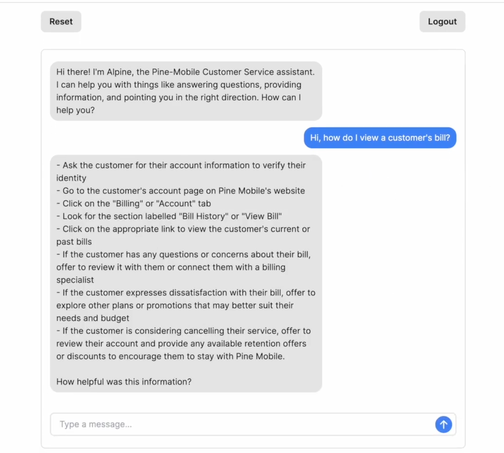

# Alpine - the customer service chatbot

A Chatbot for Customer Service Agents using Next.js, TypeScript, and Tailwind CSS, and Auth0.

See a [demo](https://youtu.be/o4nPTXq9EpM).




## Features
- Our backend is powered by Python, utilizing AWS and Lambda, while FastAPI serves as the middleware.
- For the frontend, we employ NextJS + TypeScript and host in Vercel.
- To improve the interaction with the knowledge base, we leverage OpenAI LLM for embedding the manuals stored in Pinecone.
- Authentication is facilitated through the implementation of Auth0.

## Deploy

We used **Vercel** for deployment

## Running Locally

**1. Clone Repo**

```bash
git clone https://github.com/zarifaziz/chatbot-ui-lite.git
```

**2. Install Dependencies**

```bash
npm i
```

**3. Run App**

```bash
npm run dev
```

**4. Start Chatting**

You should be able to start chatting with the bot.
